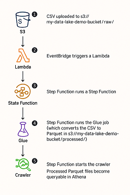

# AWS DevOps Serverless Data Pipeline Project

This project demonstrates a fully automated, event-driven ETL pipeline built with AWS and Terraform. It highlights core **DataOps** and **DevOps** principles by combining infrastructure automation, orchestration, and monitoring.

### 🚀 Key Features

- ✅ **100% Infrastructure as Code (IaC)** using Terraform
- ✅ **Event-driven architecture**: S3 → Lambda → Step Functions → Glue
- ✅ **PySpark ETL**: CSV files are converted to Parquet format
- ✅ **Athena-ready**: Query transformed data using the Glue Data Catalog
- ✅ **Reusable modular design**: Clean separation between infrastructure, ETL, and orchestration
- ✅ **Cloud-native monitoring**: CloudWatch alarms for Glue, Lambda, and Step Functions
- ✅ **Centralized tagging**: Consistent tagging for cost tracking and resource visibility

---

## 🔁 Full Automation with Terraform

This project provisions a complete data pipeline using **Terraform only**.

When you run:

```bash
terraform init
terraform apply
```

Terraform automatically creates:

- ✅ An S3 bucket with `raw/`, `processed/`, and `scripts/` prefixes  
- ✅ A Glue database  
- ✅ A Glue crawler for `processed/`  
- ✅ A Glue ETL job (converts CSV to Parquet)  
- ✅ A Lambda function that starts the Step Function  
- ✅ A Step Function to orchestrate the ETL + crawler  
- ✅ An EventBridge rule that triggers on S3 upload

> No manual setup required — all resources are created and wired automatically.


## Folder Structure

```
aws-data-devops-001/
├── infra/              # Core infrastructure (IAM, S3, EventBridge, Lambda)
├── etl/                # ETL components (Glue job, crawler, database)
├── orchestration/      # Step Function to orchestrate the ETL pipeline
├── monitoring/         # Monitoring with CloudWatch Alarms
├── scripts/            # Python scripts for the ETL job
├── main.tf             # Root Terraform configuration to wire modules together
├── versions.tf         # Provider and Terraform versions
├── locals.tf           # Defines shared variables for consistent naming and configuration.
```

---

## Module Overview

### Infra

- **s3\_bucket/**: Creates the raw/ and processed/ folders in the data lake bucket.
- **glue\_iam\_role/**: IAM role for Glue to access S3 and execute jobs.
- **lambda\_trigger\_step\_function\_etl/**: Lambda function that triggers Step Function on S3 upload.
- **eventbridge\_s3\_to\_lambda/**: EventBridge rule that listens to `raw/` folder and invokes the Lambda.

### ETL

- **glue\_database/**: Creates a Glue Data Catalog database.
- **glue\_crawler/**: Scans `processed/` folder and updates metadata tables.
- **glue\_job/**: PySpark job that converts CSV to Parquet.

### Orchestration

- **step\_function\_etl/**: Orchestrates job execution and crawler start using AWS Step Functions.

---

## Flow Summary

1. A CSV file is uploaded to `s3://my-data-lake-demo-bucket/raw/`
2. EventBridge detects the upload and triggers a Lambda function
3. The Lambda function starts an execution of a Step Function (designed to safely handle concurrent executions if multiple CSVs are uploaded)
4. The Step Function launches a Glue ETL job (which converts the CSV to Parquet in `s3://my-data-lake-demo-bucket/processed/`)
5. The Step Function waits until the job completes
6. Once the job is done, the Step Function starts a Glue Crawler
7. The Crawler updates the Glue Data Catalog with the new Parquet schema
8. The resulting data in `processed/` becomes queryable in Athena



---


## 🔍 Athena Queries

Once the ETL pipeline runs successfully, your transformed Parquet data is queryable in **Amazon Athena**.

### 🧪 Example Queries

**Preview the `customers` table:**
```sql
SELECT * FROM "data_lake_db"."customers" LIMIT 10;
```

**Join `customers` and `orders`:**
```sql
SELECT 
  c.customer_id, 
  c.name, 
  o.order_id, 
  o.amount
FROM 
  "data_lake_db"."customers" c
JOIN 
  "data_lake_db"."orders" o 
ON 
  c.customer_id = o.customer_id
LIMIT 10;
```

You can find these queries in the [`athena/`](./athena) folder.

---

## 📈 Monitoring (CloudWatch)

This project includes monitoring and alerting for key components of the data pipeline using **Amazon CloudWatch**.

### ✅ What's Monitored

- **Glue Job Failures**
  - Alarm: Triggers if any Glue job fails (`FailedJobs > 0`)
- **Step Function Failures**
  - Alarm: Triggers if any Step Function execution fails (`ExecutionsFailed > 0`)
- **Lambda Function Errors**
  - Alarm: Triggers if the Lambda function encounters errors (`Errors > 0`)

### 🔔 How It Works

- CloudWatch Alarms are created via Terraform in the `monitoring/` module.
- All alarms use a 5-minute evaluation window.
- You can view them in the CloudWatch console under:
  - Alarms → All Alarms
  - Or directly from the “Overview” dashboard

---

## 🏷 Resource Tagging

All AWS resources provisioned by this project are consistently tagged using a common tag set. These tags help with:

- 💰 **Cost allocation**
- 🛡️ **Security auditing**
- 📊 **Resource tracking**
- 📁 **Environment and ownership classification**

### ✅ Default Tags Applied

```hcl
Environment = "dev"
Team        = "DataEngineering"
Project     = "aws-data-devops-001"
Owner       = "Antonio"
```

You can view these tags in the AWS Console on each resource page under the **Tags** tab.  
They are defined centrally in `locals.tf` and passed to all modules using `var.tags`.

---

## Requirements

- Terraform >= 1.0
- AWS CLI configured
- Python + zip for packaging Lambda

---

## Deploy

```sh
terraform init
terraform apply -auto-approve
```